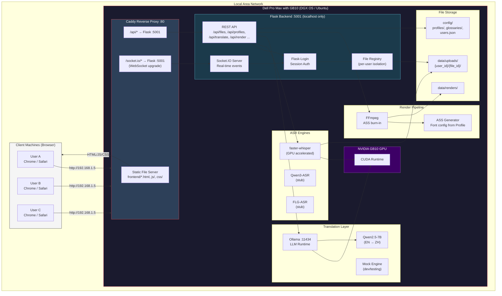
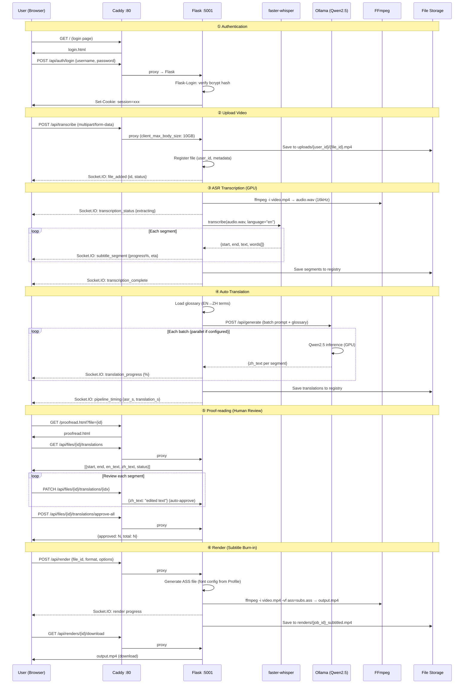
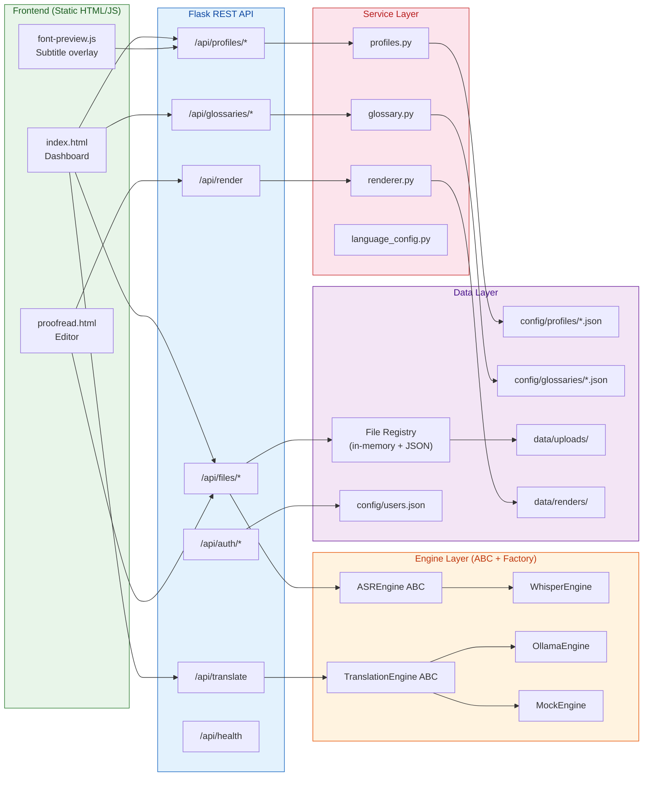

# MoTitle — System Architecture & Flow Diagrams

## 1. System Architecture Diagram (LAN Deployment)

```mermaid
graph TB
    subgraph LAN["Local Area Network"]
        subgraph Clients["Client Machines (Browser)"]
            C1["User A<br/>Chrome / Safari"]
            C2["User B<br/>Chrome / Safari"]
            C3["User C<br/>Chrome / Safari"]
        end

        subgraph Dell["Dell Pro Max with GB10 (DGX OS / Ubuntu)"]
            subgraph Caddy["Caddy Reverse Proxy :80"]
                STATIC["Static File Server<br/>frontend/*.html, js/, css/"]
                PROXY_API["/api/* → Flask :5001"]
                PROXY_WS["/socket.io/* → Flask :5001<br/>(WebSocket upgrade)"]
            end

            subgraph Backend["Flask Backend :5001 (localhost only)"]
                AUTH["Flask-Login<br/>Session Auth"]
                API["REST API<br/>/api/files, /api/profiles,<br/>/api/translate, /api/render ..."]
                WS["Socket.IO Server<br/>Real-time events"]
                REGISTRY["File Registry<br/>(per-user isolation)"]
            end

            subgraph ASR["ASR Engines"]
                WHISPER["faster-whisper<br/>(GPU accelerated)"]
                QWEN_ASR["Qwen3-ASR<br/>(stub)"]
                FLG["FLG-ASR<br/>(stub)"]
            end

            subgraph Translation["Translation Layer"]
                OLLAMA["Ollama :11434<br/>LLM Runtime"]
                QWEN["Qwen2.5-7B<br/>(EN → ZH)"]
                MOCK["Mock Engine<br/>(dev/testing)"]
            end

            subgraph Render["Render Pipeline"]
                FFMPEG["FFmpeg<br/>ASS burn-in"]
                ASS["ASS Generator<br/>Font config from Profile"]
            end

            subgraph Storage["File Storage"]
                UPLOADS["data/uploads/<br/>{user_id}/{file_id}/"]
                RENDERS["data/renders/"]
                CONFIG["config/<br/>profiles/, glossaries/,<br/>users.json"]
            end

            subgraph GPU["NVIDIA GB10 GPU"]
                CUDA["CUDA Runtime"]
            end
        end
    end

    C1 -->|"http://192.168.1.5"| Caddy
    C2 -->|"http://192.168.1.5"| Caddy
    C3 -->|"http://192.168.1.5"| Caddy

    STATIC -->|"HTML/JS/CSS"| Clients
    PROXY_API --> API
    PROXY_WS --> WS

    API --> AUTH
    WS --> AUTH
    AUTH --> REGISTRY

    API --> WHISPER
    API --> OLLAMA
    API --> FFMPEG

    WHISPER --> CUDA
    OLLAMA --> CUDA
    OLLAMA --> QWEN

    WHISPER --> UPLOADS
    FFMPEG --> ASS
    FFMPEG --> RENDERS
    REGISTRY --> UPLOADS
    API --> CONFIG

    style Dell fill:#1a1a2e,stroke:#e94560,color:#fff
    style Caddy fill:#2d4059,stroke:#ea5455,color:#fff
    style Backend fill:#1b3a4b,stroke:#65c6e0,color:#fff
    style GPU fill:#3d0066,stroke:#9b59b6,color:#fff
    style Clients fill:#f5f5f5,stroke:#333,color:#333
```

## 2. System Flow Diagram (Subtitle Production Pipeline)

```mermaid
sequenceDiagram
    participant U as User (Browser)
    participant C as Caddy :80
    participant F as Flask :5001
    participant W as faster-whisper
    participant O as Ollama (Qwen2.5)
    participant FF as FFmpeg
    participant FS as File Storage

    Note over U,FS: ① Authentication
    U->>C: GET / (login page)
    C->>U: login.html
    U->>C: POST /api/auth/login {username, password}
    C->>F: proxy → Flask
    F->>F: Flask-Login: verify bcrypt hash
    F->>U: Set-Cookie: session=xxx

    Note over U,FS: ② Upload Video
    U->>C: POST /api/transcribe (multipart/form-data)
    C->>F: proxy (client_max_body_size: 10GB)
    F->>FS: Save to uploads/{user_id}/{file_id}.mp4
    F->>F: Register file (user_id, metadata)
    F-->>U: Socket.IO: file_added {id, status}

    Note over U,FS: ③ ASR Transcription (GPU)
    F->>FF: ffmpeg -i video.mp4 → audio.wav (16kHz)
    F-->>U: Socket.IO: transcription_status {extracting}
    F->>W: transcribe(audio.wav, language="en")
    loop Each segment
        W-->>F: {start, end, text, words[]}
        F-->>U: Socket.IO: subtitle_segment {progress%, eta}
    end
    F->>FS: Save segments to registry
    F-->>U: Socket.IO: transcription_complete

    Note over U,FS: ④ Auto-Translation
    F->>F: Load glossary (EN→ZH terms)
    F->>O: POST /api/generate (batch prompt + glossary)
    loop Each batch (parallel if configured)
        O->>O: Qwen2.5 inference (GPU)
        O-->>F: {zh_text per segment}
        F-->>U: Socket.IO: translation_progress {%}
    end
    F->>FS: Save translations to registry
    F-->>U: Socket.IO: pipeline_timing {asr_s, translation_s}

    Note over U,FS: ⑤ Proof-reading (Human Review)
    U->>C: GET /proofread.html?file={id}
    C->>U: proofread.html
    U->>C: GET /api/files/{id}/translations
    C->>F: proxy
    F->>U: [{start, end, en_text, zh_text, status}]

    loop Review each segment
        U->>C: PATCH /api/files/{id}/translations/{idx}
        C->>F: {zh_text: "edited text"} (auto-approve)
    end
    U->>C: POST /api/files/{id}/translations/approve-all
    C->>F: proxy
    F->>U: {approved: N, total: N}

    Note over U,FS: ⑥ Render (Subtitle Burn-in)
    U->>C: POST /api/render {file_id, format, options}
    C->>F: proxy
    F->>F: Generate ASS file (font config from Profile)
    F->>FF: ffmpeg -i video.mp4 -vf ass=subs.ass → output.mp4
    F-->>U: Socket.IO: render progress
    F->>FS: Save to renders/{job_id}_subtitled.mp4
    U->>C: GET /api/renders/{id}/download
    C->>F: proxy
    F->>U: output.mp4 (download)
```

## 3. Component Dependency Map

```mermaid
graph LR
    subgraph Frontend["Frontend (Static HTML/JS)"]
        INDEX["index.html<br/>Dashboard"]
        PROOF["proofread.html<br/>Editor"]
        FONT["font-preview.js<br/>Subtitle overlay"]
    end

    subgraph API["Flask REST API"]
        FILES["/api/files/*"]
        PROFILES["/api/profiles/*"]
        GLOSSARIES["/api/glossaries/*"]
        TRANSLATE["/api/translate"]
        RENDER_API["/api/render"]
        AUTH_API["/api/auth/*"]
        HEALTH["/api/health"]
    end

    subgraph Engines["Engine Layer (ABC + Factory)"]
        ASR_ABC["ASREngine ABC"]
        TRANS_ABC["TranslationEngine ABC"]
        WHISPER_E["WhisperEngine"]
        OLLAMA_E["OllamaEngine"]
        MOCK_E["MockEngine"]
    end

    subgraph Services["Service Layer"]
        PROFILES_SVC["profiles.py"]
        GLOSSARY_SVC["glossary.py"]
        RENDERER_SVC["renderer.py"]
        LANG_SVC["language_config.py"]
    end

    subgraph Data["Data Layer"]
        REG["File Registry<br/>(in-memory + JSON)"]
        PROFILE_JSON["config/profiles/*.json"]
        GLOSS_JSON["config/glossaries/*.json"]
        USERS_JSON["config/users.json"]
        UPLOAD_DIR["data/uploads/"]
        RENDER_DIR["data/renders/"]
    end

    INDEX --> FILES
    INDEX --> PROFILES
    INDEX --> GLOSSARIES
    INDEX --> TRANSLATE
    PROOF --> FILES
    PROOF --> RENDER_API
    FONT --> PROFILES

    FILES --> REG
    FILES --> ASR_ABC
    TRANSLATE --> TRANS_ABC
    RENDER_API --> RENDERER_SVC
    PROFILES --> PROFILES_SVC
    GLOSSARIES --> GLOSSARY_SVC
    AUTH_API --> USERS_JSON

    ASR_ABC --> WHISPER_E
    TRANS_ABC --> OLLAMA_E
    TRANS_ABC --> MOCK_E

    PROFILES_SVC --> PROFILE_JSON
    GLOSSARY_SVC --> GLOSS_JSON
    RENDERER_SVC --> RENDER_DIR
    REG --> UPLOAD_DIR

    style Frontend fill:#e8f5e9,stroke:#2e7d32,color:#1b5e20
    style API fill:#e3f2fd,stroke:#1565c0,color:#0d47a1
    style Engines fill:#fff3e0,stroke:#e65100,color:#bf360c
    style Services fill:#fce4ec,stroke:#c62828,color:#b71c1c
    style Data fill:#f3e5f5,stroke:#6a1b9a,color:#4a148c
```
